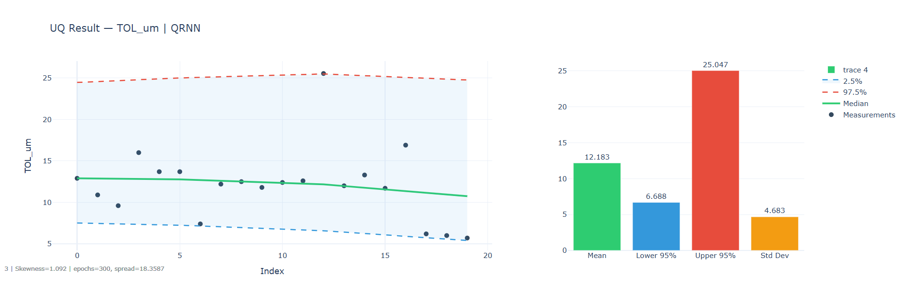
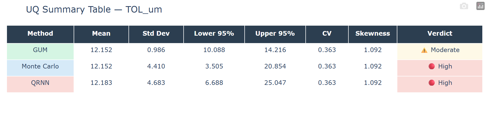
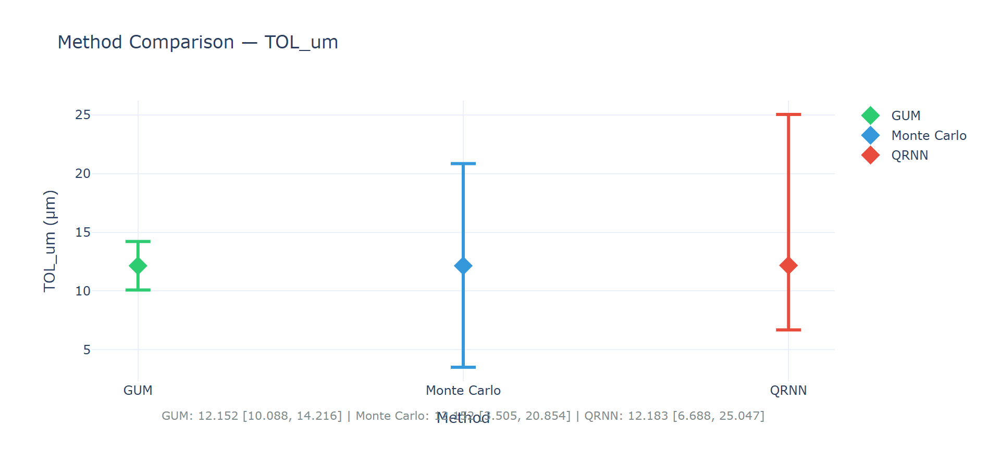
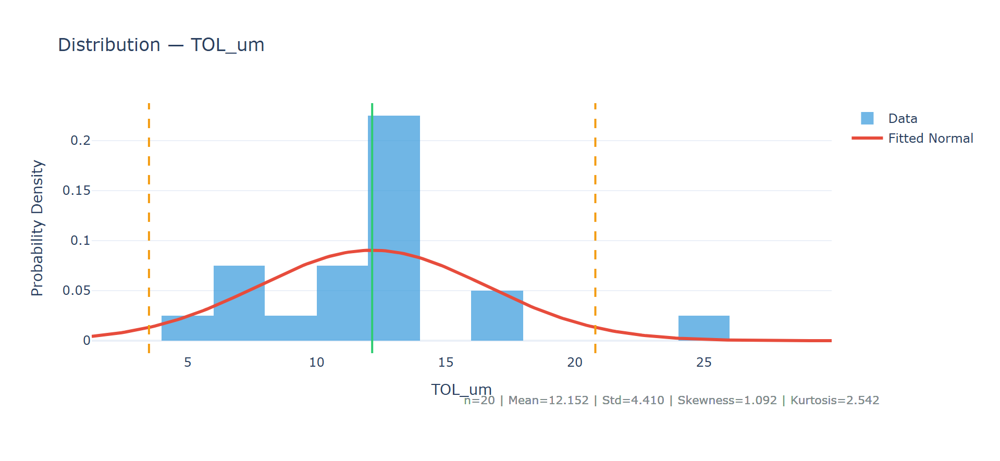
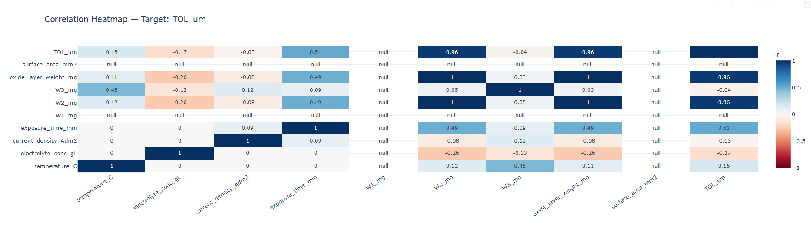

# materials-uq-engine

**Adaptive Uncertainty Quantification for Materials Science Datasets**

A Python engine that automatically selects and runs the right uncertainty quantification method for your experimental data — and outputs five interactive HTML reports you can open in any browser.

---

## Why Uncertainty Quantification Matters in Materials Science

In materials research, every measurement carries uncertainty. A reported oxide layer thickness of 12.15 μm is not a precise value — it is the center of a distribution shaped by instrument noise, environmental variation, sample preparation inconsistency, and measurement technique limitations.

Without UQ, researchers make three common mistakes:

1. **Overconfidence** — reporting a single value as if it were exact, leading to flawed comparisons between experimental conditions
2. **Wrong method** — applying GUM (a linear analytical formula) to highly nonlinear data where it systematically underestimates uncertainty
3. **No sensitivity insight** — not knowing which process variable (temperature? current density?) is actually driving the variability in the output

This engine solves all three.

---

## How It Works

The engine measures the **coefficient of variation (CV)** of your target data and automatically selects the appropriate method:

```
CV < 0.05  →  GUM          Linear data, ISO analytical propagation
CV < 0.20  →  Monte Carlo  Nonlinear data, 50,000-sample simulation
CV ≥ 0.20  →  QRNN         Noisy/skewed data, deep learning quantile regression
```

You can also force any method manually.

---

## Methods

### GUM — Guide to the Expression of Uncertainty in Measurement
The international standard (ISO/IEC 98-3) for analytical uncertainty propagation. Uses Type A (statistical) uncertainty from repeated measurements and computes an expanded uncertainty with a coverage factor k derived from the t-distribution. Best for low-variance, near-linear data.

**Output:** mean ± expanded U95, coverage factor k, effective degrees of freedom

### Monte Carlo Simulation
Fits a distribution to your data and draws 50,000 random samples, propagating them through the measurement model. Captures nonlinearity and asymmetry that GUM misses entirely. The 2.5th and 97.5th percentiles of the output distribution form the 95% confidence interval.

**Output:** mean, std, 2.5–97.5 percentile CI, skewness, full sample distribution

### QRNN — Quantile Regression Neural Network
A PyTorch neural network trained directly on your data to simultaneously predict the 2.5%, 50%, and 97.5% quantile bounds using pinball loss. No distribution assumptions. Handles noisy, skewed, or nonlinear datasets where GUM and Monte Carlo both struggle.

**Output:** predicted median, lower/upper quantile bounds, uncertainty spread

---

## Outputs

Running `python run_uq.py` generates **5 interactive HTML files** in `/output`:

| File | What it shows |
|------|---------------|
| `1_uq_TOL_um_qrnn.html` | Main UQ result — raw data + uncertainty bounds + statistics bar |
| `2_summary_table.html` | Side-by-side table: GUM vs MC vs QRNN with verdict |
| `3_comparison.html` | Visual CI comparison across all 3 methods |
| `4_distribution.html` | Histogram + fitted normal + descriptive stats |
| `5_correlation.html` | Correlation heatmap: which process variables drive TOL? |

### Main UQ Result


### Method Summary Table


### Method Comparison


### Data Distribution


### Correlation Heatmap


---

## Quick Start

```bash
# Clone and install
git clone https://github.com/annegracia/materials-uq-engine.git
cd materials-uq-engine
pip install -r requirements.txt

# Run on sample data (auto method selection)
python run_uq.py

# Run with specific settings
python run_uq.py --file data/anodization_TOL.csv --target TOL_um --method GUM
python run_uq.py --file data/anodization_TOL.csv --target TOL_um --method "Monte Carlo"
python run_uq.py --file data/anodization_TOL.csv --target TOL_um --method QRNN
```

---

## Repository Structure

```
materials-uq-engine/
├── uq_engine.py              ← all UQ methods + Plotly visualizations
├── run_uq.py                 ← CLI test runner
├── data/
│   └── anodization_TOL.csv   ← oxide layer thickness dataset
├── output/                   ← generated HTML plots land here
├── requirements.txt
└── README.md
```

---

## Sample Dataset

`data/anodization_TOL.csv` — **Oxide Layer Thickness (TOL) from Anodization Process Optimization**

20 experimental runs on aluminium automotive plungers, varying:
- Temperature (°C)
- Electrolyte concentration (g/L)
- Current density (A/dm²)
- Exposure time (min)

Target: TOL (μm) — oxide layer thickness measured gravimetrically

**CV = 0.36** → QRNN selected automatically (high variance, right-skewed distribution)

**Key finding from UQ:**
- GUM underestimates the upper bound because the data is right-skewed (skewness = 1.09)
- QRNN correctly captures the asymmetric uncertainty envelope
- Correlation heatmap shows exposure time and temperature are the dominant drivers of TOL variability

This dataset comes from real industrial research at Brakes India Pvt. Ltd. — optimizing the anodization process to improve corrosion resistance of automotive components.

---

## Adding Your Own Data

1. Place your CSV in `/data`
2. Run: `python run_uq.py --file data/your_file.csv --target your_column`

The engine handles any numerical target column. No code changes needed.

---

## Dependencies

```
numpy, pandas, scipy    ← core numerics
plotly                  ← interactive HTML plots
torch                   ← QRNN neural network
openpyxl                ← Excel file support
```

---

## Author

**Anne Gracia A**  
Chemical Engineer & Materials Researcher  
N-ERGY AI Solutions | SSN College of Engineering, Chennai  
[annegracia.github.io](https://annegracia.github.io) · [LinkedIn](https://linkedin.com/in/anne-gracia-66a53b26a)

---

## License

MIT — free to use, modify, and build on.
